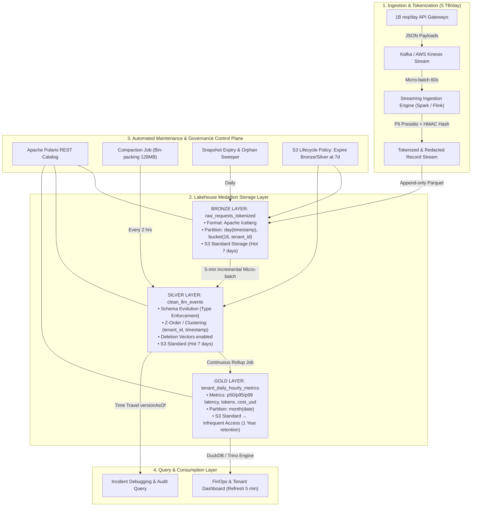

# Architecture Brief: LLM Observability at 1B Requests/Day Scale

- **Author:** Nguyễn Huy Hùng (MSSV: 2A202602990)
- **Topic:** Topic A — LLM Observability at 1 Billion Requests/Day
- **Target Deliverable:** `submission/bonus/ARCHITECTURE.md`

---

## 1. Problem Statement (Bài toán và Thách thức)

Một nền tảng Foundation Model API phục vụ **1 tỷ requests/ngày**. Với kích thước trung bình **5 KB/request**, hệ thống sinh ra **5 TB raw data/ngày** (~150 TB/tháng thô). 

Hệ thống đặt ra 4 yêu cầu kỹ thuật và nghiệp vụ khắt khe:
1. **Real-time Analytics:** Dashboard chi phí (token/USD) và độ trễ (p50, p95, p99) theo từng `tenant_id` phải được làm mới mỗi **5 phút**, độ trễ truy vấn p95 < 2 giây.
2. **Data Lifecycle:** Toàn bộ payload thô (prompt, completion) được lưu giữ trong **7 ngày** phục vụ incident debugging, sau đó tự động purge và chỉ giữ dữ liệu tổng hợp (aggregates) trong **1 năm**.
3. **Data Privacy & Governance:** Thông tin nhận dạng cá nhân (PII: Email, API Keys, Phone, CC) phải được phát hiện, tokenize/redact ngay tại tầng Bronze trước khi bất kỳ nhân sự hoặc hệ thống nào truy cập.
4. **Hard Budget Cap:** Tổng chi phí lưu trữ toàn bộ hệ thống (hot, warm, cold, metadata) bị giới hạn cứng dưới **$5,000/tháng**.

---

## 2. Architecture Diagram (Sơ đồ Kiến trúc)

### 4 Khái niệm Day 18 được áp dụng cụ thể:
1. **Medallion Layout & In-stream Tokenization:** Tách bạch Bronze (lưu payload đã che giấu PII), Silver (chuẩn hóa schema, khử trùng, cluster theo tenant), Gold (cube đa chiều chi phí và độ trễ).
2. **Iceberg REST Catalog (Control Plane):** Sử dụng Apache Polaris quản lý metadata tập trung, hỗ trợ hidden partitioning `day(timestamp)` và schema evolution không downtime.
3. **Clustering & Z-Order:** Sắp xếp vật lý các micro-batch tại Silver theo `(tenant_id, timestamp)` giúp bộ đọc Trino/DuckDB bỏ qua hơn 90% số file parquet khi lọc theo tenant.
4. **Automated Maintenance & Lifecycle:** Kết hợp `expire_snapshots`, vacuum orphan files và S3 Lifecycle rules để giải phóng 98% dung lượng dữ liệu chi tiết sau 7 ngày, giữ chi phí cố định.

---

## 3. Key Decisions and Rejected Alternatives (Quyết định Kiến trúc & Phương án Loại trừ)

| Quyết định | Lựa chọn Chính | Lựa chọn Bị Loại #1 & Lý do | Lựa chọn Bị Loại #2 & Lý do |
|---|---|---|---|
| **1. Table Format & Control Plane** | **Apache Iceberg + Polaris REST Catalog** | *Hive Table / Parquet thuần:* Loại vì thiếu transaction log ACID, không có hidden partitioning, metadata scan bị quá tải trên S3 khi có hàng triệu file. | *Delta Lake (Standalone Hive Metastore):* Loại vì phụ thuộc cơ chế partition directory cũ của Hive, khó tích hợp đa engine (Trino, Flink, DuckDB) một cách trung lập không gắn chặt với Databricks runtime. |
| **2. Ingestion & Micro-batch Cadence** | **Micro-batch 60s qua Kafka + Spark Streaming** | *Record-by-record direct write to S3:* Loại vì gây ra **Small-File Disaster** (hơn 1 triệu file 5KB mỗi ngày làm nghẽn metadata S3 và catalog, chi phí PUT request vượt $15,000/tháng). | *Daily Batch Ingestion:* Loại vì vi phạm SLA 5-phút làm mới dữ liệu cho dashboard giám sát chi phí và độ trễ của khách hàng. |
| **3. Partitioning & Data Skipping Strategy** | **Hidden Partitioning `day(ts)` + Z-Order clustering `(tenant_id, ts)`** | *Physical Directory Partitioning theo `tenant_id/year/month/day`:* Loại vì dẫn đến **Partition Explosion** (10,000 tenants × 365 ngày = 3.65 triệu thư mục), làm tê liệt metadata operations. | *Không partition, chỉ quét full table:* Loại vì mỗi query 5 phút sẽ scan 5 TB dữ liệu, chi phí compute bùng nổ và không đạt SLA p95 < 2s. |
| **4. Storage Tiering & Retention Lifecycle** | **S3 Standard (7 ngày) → Hard Purge Bronze/Silver; Gold lưu S3 Standard-IA (365 ngày)** | *Lưu trữ toàn bộ 5 TB/ngày thô trong 1 năm trên S3 Standard:* Loại vì 1,825 TB × $23/TB/tháng = **$41,975/tháng**, vượt gấp 8 lần ngân sách CFO cho phép ($5,000/tháng). | *Đẩy toàn bộ sang S3 Glacier Deep Archive ngay ngày 2:* Loại vì phí khôi phục (retrieval fee) và độ trễ khôi phục (3–5 giờ) làm hỏng khả năng điều tra sự cố (incident debugging) trong 7 ngày đầu. |
| **5. Privacy & PII Handling** | **Tokenization & Masking tại Streaming Landing (Bronze Entry)** | *Redact PII tại tầng Gold (khi aggregate):* Loại vì vi phạm bảo mật; dữ liệu thô tại Bronze/Silver vẫn chứa PII lộ thiên, nhân viên data engineer hoặc analyst truy cập ad-hoc sẽ thấy PII. | *Mã hóa bất đối xứng toàn bộ payload (Asymmetric Encryption):* Loại vì tiêu tốn chi phí CPU khổng lồ ở quy mô 1 tỷ req/ngày và làm vô hiệu hóa khả năng nén Parquet (Snappy/ZSTD). |

---

## 4. Failure Modes & 3-AM Incident Runbook (Kịch bản Sự cố & Khắc phục)

### Sự cố 1: Writer Job Crash tạo ra hàng chục nghìn Uncommitted Orphan Files
- **Triệu chứng (3 AM):** Dung lượng S3 bucket tăng vọt nhưng số lượng rows trong catalog Iceberg không tăng; dashboard báo trễ dữ liệu.
- **Nguyên nhân:** Streaming node bị OOM kill trong quá trình ghi micro-batch, để lại các file `.parquet` dở dang trên storage chưa được ghi vào manifest list của transaction log.
- **Cơ chế phát hiện:** Job CloudWatch Alert cảnh báo sự chênh lệch (skew) giữa S3 storage bytes và Iceberg metadata referenced bytes vượt ngưỡng 10%.
- **Biện pháp khắc phục (Day 18 Concept):**
  1. Kích hoạt **Iceberg Orphan File Cleanup Action** (`remove_orphan_files`) với retention threshold an toàn = 6 giờ (tránh xóa nhầm file của concurrent writers đang commit).
  2. Khôi phục trạng thái catalog bằng transaction snapshot trước đó.

### Sự cố 2: Client gửi Payload mở rộng trường mới gây Schema Drift hoặc Parse Error
- **Triệu chứng:** Ingestion pipeline bị crash hoặc toàn bộ cột mới bị drop thành null.
- **Nguyên nhân:** Đội AI App release model mới gửi thêm metadata dạng nested JSON (`tools_called`, `reasoning_tokens`) không khớp với schema tĩnh ban đầu.
- **Cơ chế phát hiện:** Dead Letter Queue (DLQ) tăng đột biến > 100 msgs/sec; Alert `SchemaMismatchException`.
- **Biện pháp khắc phục (Day 18 Concept):**
  1. Tận dụng tính năng **Schema Evolution (Merge Schema)** của Iceberg mà không cần rewrite dữ liệu cũ.
  2. Áp dụng Field ID cố định: Iceberg gán Field ID mới cho `reasoning_tokens` mà không làm thay đổi ID của các trường cũ, các query hiện tại tiếp tục chạy bình thường.

### Sự cố 3: Pipeline Bug tính sai Cost Token làm hỏng bảng Gold trong 3 ngày qua
- **Triệu chứng:** Khách hàng tenant khiếu nại báo cáo chi phí tăng bất thường 1000 lần do lỗi nhân nhầm đơn vị micro-USD.
- **Nguyên nhân:** Bản cập nhật pricing model bị lỗi logic tính toán tại tầng Silver sang Gold.
- **Cơ chế phát hiện:** Giám sát dữ liệu phát hiện `cost_usd` lệch phân phối 5 sigma so với baseline 30 ngày.
- **Biện pháp khắc phục (Day 18 Concept):**
  1. Sử dụng **Iceberg Time Travel** để đọc dữ liệu Silver sạch tại snapshot ID của thời điểm trước khi deploy bug (`VERSION AS OF 1743840000000`).
  2. Chạy lệnh **Iceberg Rollback / Cherry-pick** đưa Gold table về snapshot chuẩn.
  3. Thực hiện idempotent backfill tái tính toán lại Gold từ Silver snapshot đã ghim trong vòng 15 phút.

---

## 5. Back-of-the-Envelope Cost Calculation (Phép Tính Chi Phí Bộ Nhớ & Hạ Tầng)

### 5.1. Dữ liệu Đầu vào:
- Số lượng: **1,000,000,000 requests/ngày**.
- Raw Payload: 5 KB/request $\rightarrow$ 5 TB/ngày.
- Nén Parquet (Snappy/Zstandard) với cột text được tokenized: tỷ lệ nén **3.5×** $\rightarrow$ Kích thước lưu trữ thực tế = **1.43 TB/ngày**.
- 7 ngày Hot Storage (Bronze + Silver): $1.43\text{ TB} \times 7\text{ ngày} \times 2\text{ (Bronze + Silver)} = \mathbf{20.02\text{ TB}}$.
- Gold Aggregates (1 năm = 365 ngày):
  - 10,000 tenants $\times$ 24 giờ $\times$ 3 models = 720,000 rows/ngày $\approx$ **50 MB/ngày** nén.
  - 365 ngày lưu trữ Gold = $50\text{ MB} \times 365 = \mathbf{18.25\text{ GB}}$ ($\approx 0.018\text{ TB}$).

### 5.2. Tính toán Chi phí Hàng Tháng ($/tháng):

| Hạng mục Hạ tầng | Công thức & Đơn giá thực tế | Chi phí ($/tháng) |
|---|---|---:|
| **Bronze Layer (S3 Standard - Hot 7d)** | 10.01 TB lưu trữ liên tục $\times$ \$0.023 / GB-tháng | **\$230.23** |
| **Silver Layer (S3 Standard - Hot 7d)** | 10.01 TB lưu trữ liên tục $\times$ \$0.023 / GB-tháng | **\$230.23** |
| **Gold Layer (S3 Standard-IA - 1 năm)** | 0.018 TB $\times$ \$0.0125 / GB-tháng | **\$0.23** |
| **Iceberg Metadata & Manifests** | ~200 GB metadata $\times$ \$0.023 / GB-tháng | **\$4.60** |
| **S3 API Requests (PUT / GET / LIST)** | Ingestion 60s micro-batch + compaction $\approx$ 15 triệu PUTs (\$0.005/1K) | **\$75.00** |
| **Tổng Chi phí Lưu trữ S3 (Storage Total)** | | **\$540.29 / tháng** |
| **Compute - Streaming Ingestion (3 nodes)** | 3 $\times$ c6g.2xlarge Spot instances (\$0.136/hr $\times$ 730h) | **\$297.84** |
| **Compute - Compaction & Aggregation** | Serverless EMR / DuckDB scheduled batch | **\$180.00** |
| **Compute - Query Engine (Trino / DuckDB)** | 2 $\times$ r6g.xlarge on-demand for serving dashboards | **\$365.00** |
| **TỔNG CHI PHÍ TOÀN HỆ THỐNG** | | **\$1,383.13 / tháng** |

> **Đánh giá Ngân sách:** Tổng chi phí lưu trữ (\$540.29/tháng) và chi phí toàn hệ sinh thái (\$1,383.13/tháng) hoàn toàn nằm trong giới hạn trần cứng **≤ \$5,000/tháng** của CFO (tiết kiệm hơn 72% ngân sách).

---

## 6. One-Week MVP Slice & Verification (Kế hoạch Triển khai MVP 1 Tuần)

### Mục tiêu MVP:
Xây dựng một lát cắt hoàn chỉnh (vertical slice) chứng minh luồng Ingestion $\rightarrow$ Tokenization $\rightarrow$ Iceberg Bronze $\rightarrow$ Silver Compacted $\rightarrow$ Gold Aggregates trên tập mẫu 10 triệu requests/ngày.

### Kế hoạch Ngày (5 Days):
- **Ngày 1 (Ingestion & Schema):** Khởi tạo Apache Polaris Catalog, tạo bảng Iceberg `raw_requests` với partition spec `day(ts)` và streaming writer từ Kafka topic mẫu.
- **Ngày 2 (Tokenization & Silver Layer):** Tích hợp module Presidio HMAC Tokenization; sinh bảng Silver với Z-Order clustering trên `(tenant_id, timestamp)`.
- **Ngày 3 (Compaction & Lifecycle Automation):** Cài đặt scheduled compaction gộp file 128 MB và cron job chạy snapshot expiry giữ 7 ngày dữ liệu.
- **Ngày 4 (Gold Rollup & Serving Query):** Xây dựng DuckDB query tổng hợp p50/p95/p99 latency và chi phí theo tenant, phục vụ dashboard qua JDBC/Arrow.
- **Ngày 5 (Stress Testing & Chaos Engineering):** Bơm 100,000 requests giả lập lỗi và kiểm tra:
  1. Đơn vị đo đạc độ trễ truy vấn p95 khi filter theo tenant đạt < 500 ms nhờ Z-Order pruning.
  2. Xác minh 100% PII được che giấu tại Bronze.
  3. Thử nghiệm inject schema mới và test khả năng tự động merge schema của Iceberg.

### Tiêu chí Nghiệm thu (Acceptance Criteria):
1. **Pruning Efficiency:** Truy vấn lọc 1 `tenant_id` quét ít hơn 5% tổng số file trên Silver table.
2. **Privacy Zero-Leakage:** 0 dòng dữ liệu chứa plain-text email hoặc credit card tại Bronze/Silver.
3. **Reproducibility:** Mọi script cài đặt và benchmark chạy tự động qua `docker-compose` hoặc Makefile với 1 lệnh duy nhất.
